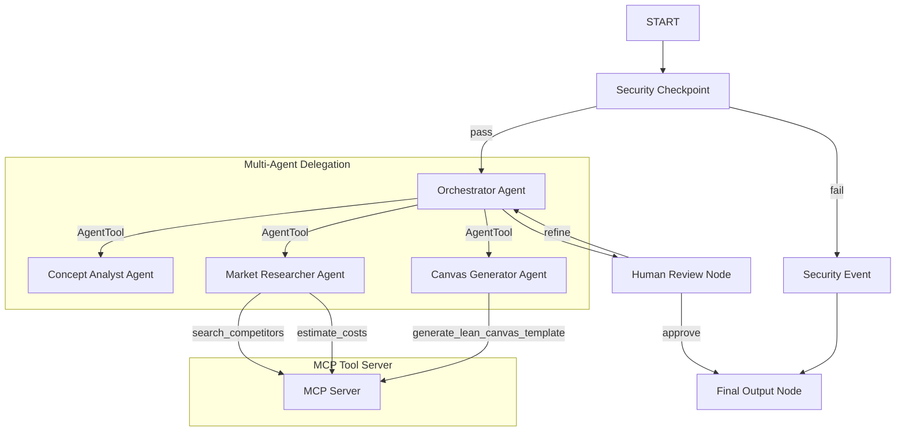

# Submission Writeup: StartupBuilder

## Problem Statement

Aspiring founders, product managers, and hackers often struggle to transition from a raw, vague business idea to a structured, validated startup plan. Standard ideation processes require hours of tedious research on competitors, market sizes, risk assessments, and layout configurations for Lean Canvases. Moreover, LLM-based ideation assistants often leak user data, are vulnerable to prompt injections, and lack access to deterministic external lookup tools (like competitor databases or cost calculators).

**StartupBuilder** solves this by providing a secure, multi-agent AI assistant that validates concepts, researches competition via a local Model Context Protocol (MCP) server, formats structured Lean Canvases, and incorporates the human founder in a tight approval loop before finalizing the pitch.

## Solution Architecture

## Concepts Used & File References

* **ADK 2.0 Workflow (Graph-Based):** Implemented in [agent.py](file:///Users/ryansinghathwal/Downloads/adk_workspace/startup-builder/app/agent.py#L262-L273) using nodes, routes, and dictionary-based routing.
* **LlmAgent:** Utilized to define the sub-agents and orchestrator in [agent.py](file:///Users/ryansinghathwal/Downloads/adk_workspace/startup-builder/app/agent.py#L54-L126).
* **AgentTool:** Used by the `orchestrator` to delegate sub-tasks dynamically to specialist agents in [agent.py](file:///Users/ryansinghathwal/Downloads/adk_workspace/startup-builder/app/agent.py#L119-L123).
* **MCP Server:** Configured as a Python Stdio service using the FastMCP SDK in [mcp_server.py](file:///Users/ryansinghathwal/Downloads/adk_workspace/startup-builder/app/mcp_server.py). Wired to `market_researcher` and `canvas_generator` via `McpToolset` in [agent.py](file:///Users/ryansinghathwal/Downloads/adk_workspace/startup-builder/app/agent.py#L69-L89).
* **Security Checkpoint Node:** Implemented as the gateway function node `security_checkpoint` in [agent.py](file:///Users/ryansinghathwal/Downloads/adk_workspace/startup-builder/app/agent.py#L132-L177).
* **Agents CLI:** Scaffolding, installation, and deployment orchestrated using `agents-cli` metadata files such as [agents-cli-manifest.yaml](file:///Users/ryansinghathwal/Downloads/adk_workspace/startup-builder/agents-cli-manifest.yaml).

## Security Design

1. **PII Scrubbing:** Using regular expressions, the `security_checkpoint` scans user input for phone numbers and email addresses, redacting them to `[PHONE_REDACTED]` and `[EMAIL_REDACTED]`. This ensures personal contact information is never leaked to outer sub-agents or training endpoints.
2. **Prompt Injection Prevention:** The system checks the user's startup description for known injection attack keywords (like `dan mode`, `ignore previous instructions`). If found, it routes to `security_event` to cleanly terminate and warn the user.
3. **Structured JSON Audit Logs:** Every security decision logs a JSON audit trail (written to standard out with metadata including timestamps and flags). Severity is graded as `INFO` (clean), `WARNING` (PII redacted / prohibited niche), or `CRITICAL` (injection detected) for enterprise auditing.
4. **Prohibited Business Vertical Filter (Domain Rule):** StartupBuilder enforces safety boundaries by checking for illegal/harmful startup concepts (e.g. gambling, drugs, weapons). Prohibited ideas are automatically blocked.

## MCP Server Design

Exposed tools in [mcp_server.py](file:///Users/ryansinghathwal/Downloads/adk_workspace/startup-builder/app/mcp_server.py):
1. **`search_competitors(industry: str) -> str`**: Fetches a text summary of standard industry competitors. Used by `market_researcher` to anchor research in real-world companies.
2. **`estimate_costs(industry: str, team_size: int) -> str`**: Calculates average monthly team costs and gpu/infrastructure hosting burn rate. Used by `market_researcher` to build financial projections.
3. **`generate_lean_canvas_template() -> str`**: Exposes the markdown layout structure for a Lean Canvas. Used by `canvas_generator` to ensure formatting consistency.

## Human-in-the-Loop (HITL) Flow

A startup proposal is useless without the founder's alignment. StartupBuilder implements a node-based **Human-in-the-Loop** pause using `RequestInput` at the `human_review` node:
* Once the orchestrator synthesizes the proposal draft, the graph pauses execution and prompts the user in the playground UI: `Do you approve this proposal? Enter 'approve' to finalize, or describe your requested refinements:`
* If the user replies with changes, the node sets the `refinement_feedback` state and routes back to the `orchestrator` to regenerate.
* If the user approves, it proceeds to the `final_output` node.

## Demo Walkthrough

The project covers three key walkthrough scenarios (elaborated in the README):
1. **Successful Run:** Standard bakery marketplace idea passes, invokes CA/MR/CG sub-agents, prompts the user for approval, and terminates successfully.
2. **PII and Prohibited Niche Check:** A user input mentioning "casino slot machine" is blocked by the prohibited domain filter.
3. **Injection Defense:** An input aiming to hijack instructions is successfully logged as `CRITICAL` and rejected.

## Impact & Value Statement

StartupBuilder significantly accelerates the early validation stage for entrepreneurs. By automating market analysis, competitive positioning, and financial templates, founders save hours of research. Security-by-design constraints ensure proprietary startup concepts remain confidential, making it a safe choice for enterprise incubation and accelerators.
